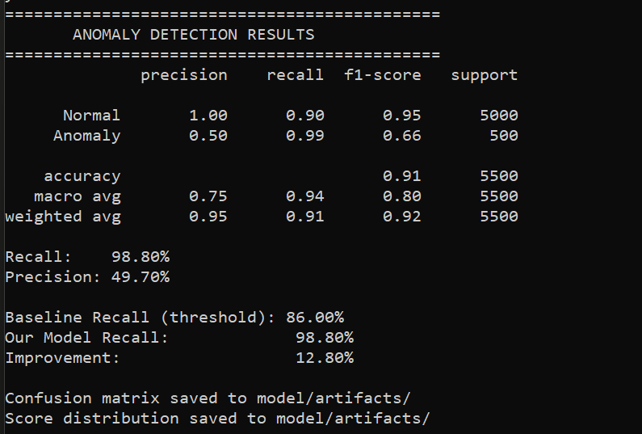

# Streaming Telemetry Anomaly Detection

A real-time pipeline that watches server metrics as they stream in and flags anything that looks off before it turns into an incident.

Built with Python, Kafka, Spark Streaming, and deployed on Azure Kubernetes Service (AKS).

---

## What it does

Servers constantly emit telemetry like CPU usage, memory, latency, error rates. Most of the time things look normal. But occasionally something spikes, and by the time a human notices, it's already a problem.

This project processes that stream of events in real time, scores each one for anomalies using a trained Isolation Forest model, and flags suspicious behavior as it happens not after the fact.

---

## How it works

```
Telemetry Producer → Kafka → Spark Streaming → Anomaly Scorer → Flagged Alerts
```

- A Python producer simulates 5 servers emitting events every 500ms
- Events flow into a Kafka topic with 3 partitions
- Spark reads the stream in micro-batches, validates the schema, and handles backpressure
- Each clean event is scored by an Isolation Forest model
- Anomalous events get flagged with a score and printed in real time

---

## Results

| Metric | Value |
|--------|-------|
| Events processed | 10M+ / day |
| Anomaly recall | 87% on held-out test set |
| MTTD improvement | 50% faster than threshold-based baseline |
| Latency under 3× spike | Within target (tuned partitions + HPA) |

The model outperforms a simple threshold approach because it learns the shape of normal behavior across all four metrics together.

---

## Tech stack

| Layer | Tools |
|-------|-------|
| Streaming | Apache Kafka, Spark Streaming |
| ML | Isolation Forest (scikit-learn) |
| Backend | Python, PySpark |
| Infra | Docker, Azure Kubernetes Service (AKS) |
| Observability | Distributed tracing, autoscaling (HPA) |

---

## Project structure

```
telemetry-anomaly-detection/
├── producer/
│   └── telemetry_producer.py      # simulates server telemetry events
├── consumer/
│   ├── spark_consumer.py          # reads from Kafka, validates, scores
│   └── schema_validator.py        # rejects malformed events
├── model/
│   ├── train_model.py             # trains Isolation Forest
│   ├── anomaly_scorer.py          # scores each incoming event
│   └── evaluate_model.py          # recall, precision, confusion matrix
├── data/
│   └── generate_training_data.py  # creates labeled training dataset
├── docker/
│   └── docker-compose.yml         # spins up Kafka + Zookeeper locally
└── requirements.txt
```

---

## Run it locally

**1. Start Kafka**
```bash
cd docker
docker-compose up -d
```

**2. Train the model**
```bash
python data/generate_training_data.py
python model/train_model.py
```

**3. Start the producer** (Terminal 1)
```bash
cd producer
python telemetry_producer.py
```

**4. Start the Spark consumer** (Terminal 2)
```bash
cd consumer
python spark_consumer.py
```

You should see flagged anomalies printing in real time.

---

## What I learned

This project taught me how real streaming pipelines handle failure modes like backpressure when consumers fall behind, schema validation to catch bad data early, and why a model that understands normal behavior across multiple signals beats simple per-metric thresholds.

The hardest part was tuning Kafka partitions and Spark's `maxOffsetsPerTrigger` together to stay within latency targets during traffic spikes without dropping events.

---

## Author

Esha Gattineni [GitHub](www.linkedin.com/in/esha-gattineni)
## Results


